# Challengework3
## Task 
The task asked for this challenge was to create a generated password box and have it display a random password based of certain criteria the user asks for. 
For example, we can have the user agree to different prompt choices of having their password include Lowercase letters, Uppercase Characters, Special Characters, Numbers, and have a 
min or max character limitation of 8 - 128 characters length. 

## Description 

The motivation behind this project was to familiar ourselves with more Javascript code and have the developer build a website that has different functionalities with prompt and confirm choices so that the user can have choices for their ideal "generated password" 
Some of the choices are as shown in the pictures below

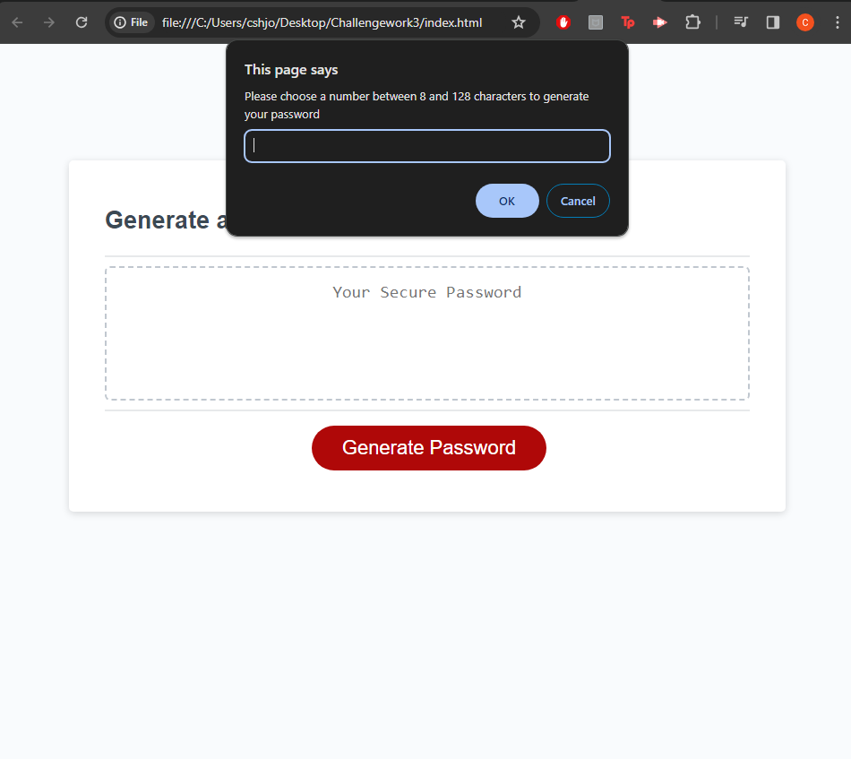
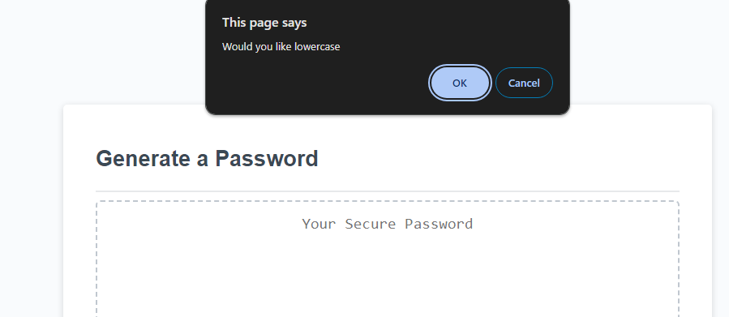
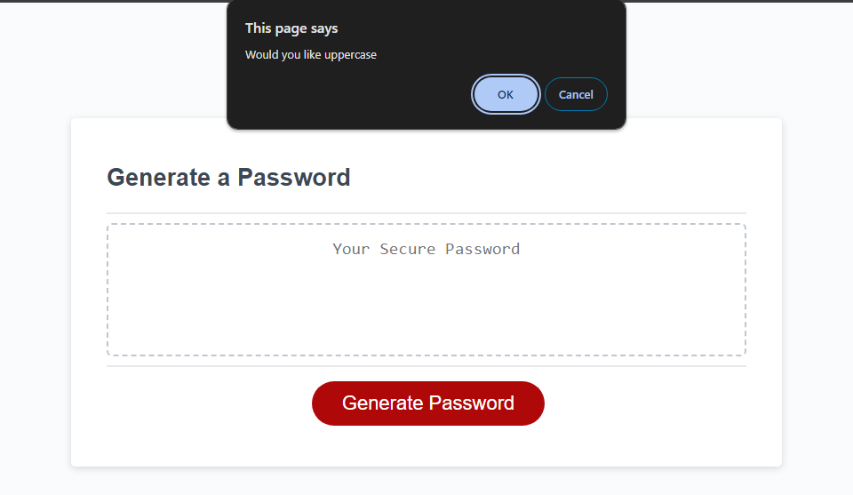
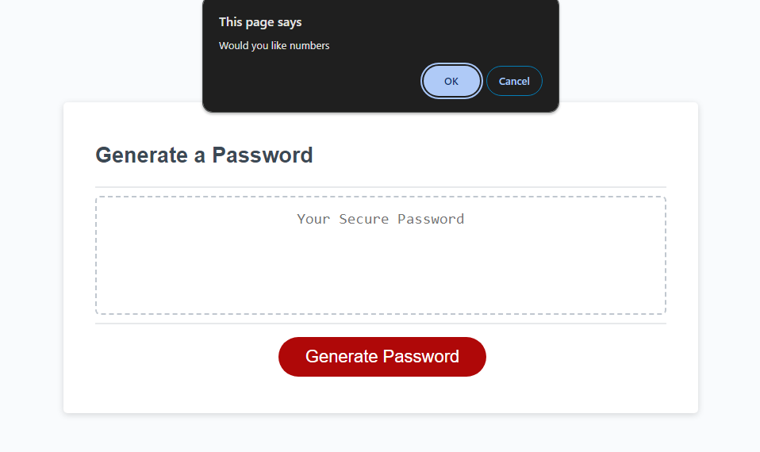

Some of the challeneges I faced throughout this challenge was numerous. 
for starters, I found it hard when the code is not organized and everything seems to be jumbled around on a page. Having to do about 2 restarts from the javascript code made it increasinly challenging because of the time constraint however, once things were organized it was easier to follow a streamline of work and have the code finally appear the way the devloper imagined. 

Another challenged faced was making sure that javascript was able to determine if the proper values were inputted when asking for character lengths. For example, when doing reasearch I found the isNaN (is not a number) will essentially recognize that we only ask for numerical inputs. (Ex : 8 does not output the same as eight) so when users decide to put eight instead of the number, it would result in false. 
doing extra research on different parts of javascript that we can implement was a joy but at the same time finding out how to implement these codes was time consuming and factored in a lot of reasearch time. 

Though after all the inputs and finalizing the generated password, I realized that the end result of what should be a generated password came out as undefined. 
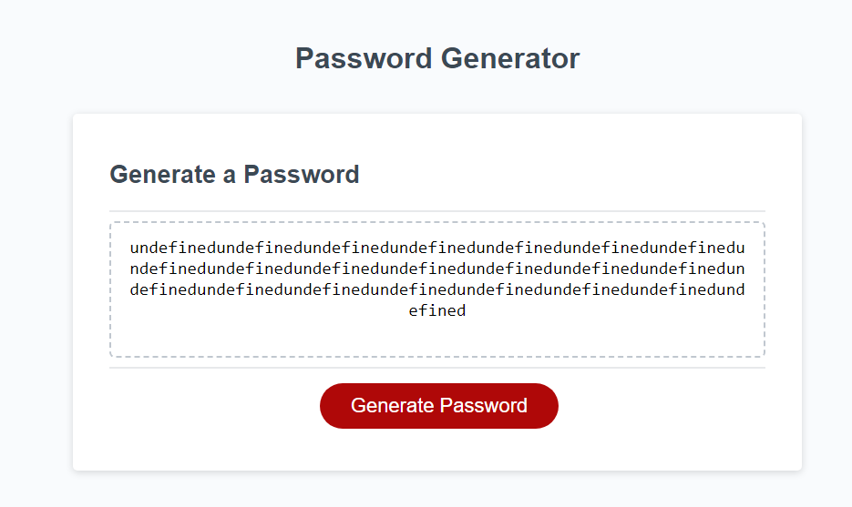

Having this issue was almost crossing the finish line however a big hill in my path. After finding more research I was able to get the completed goal of my finalized project. 
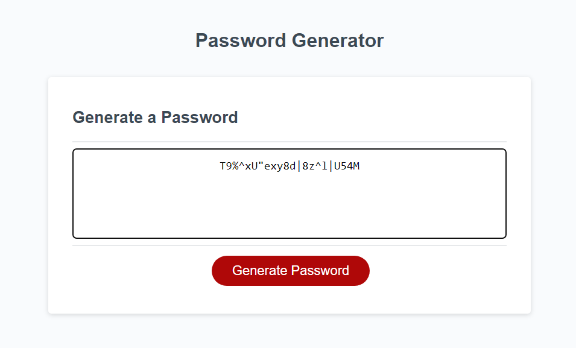

# Useage
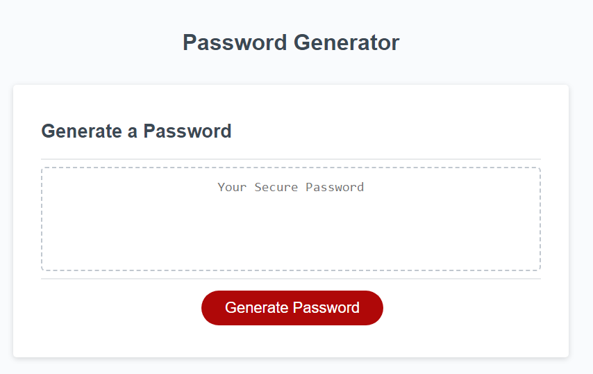
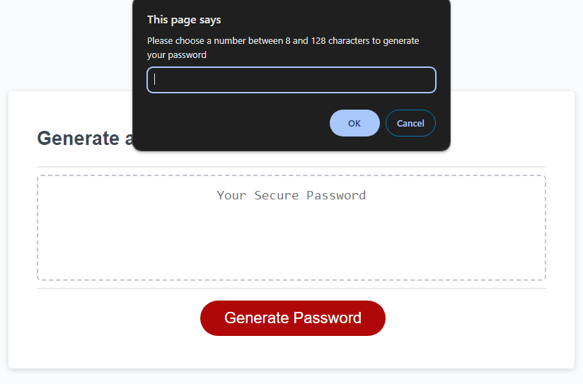
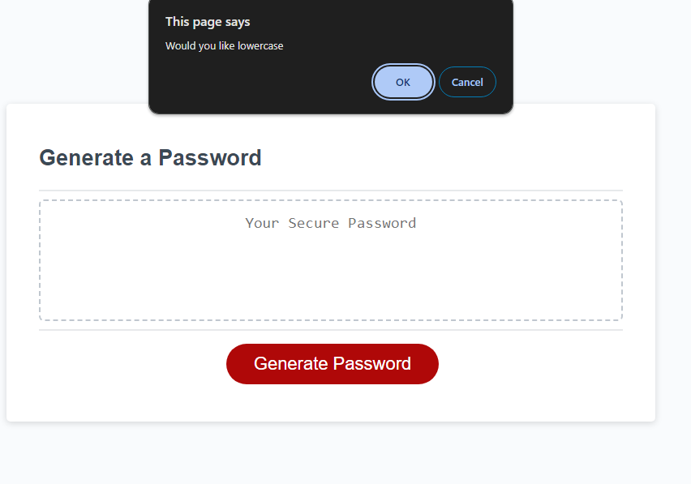

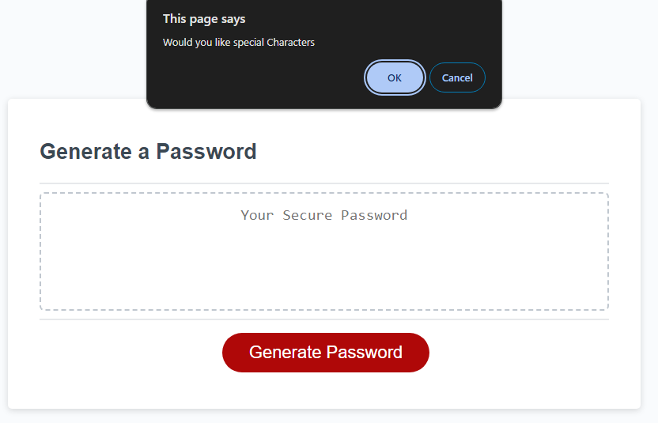
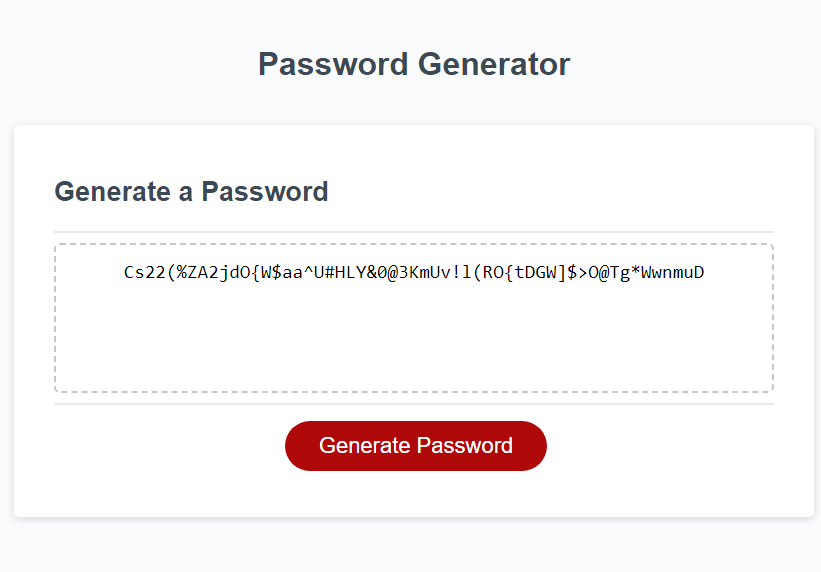

Website : file:///C:/Users/cshjo/Desktop/Challengework3/index.html

# Credits 

The staff and instructors of Columbia University Coding Bootcamp
